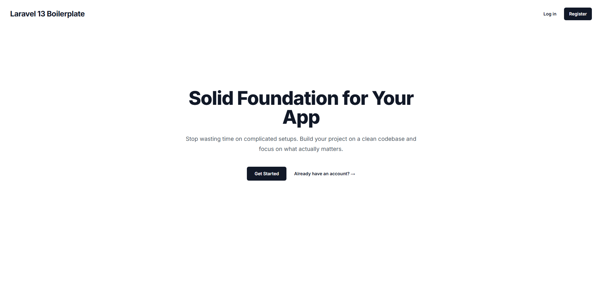
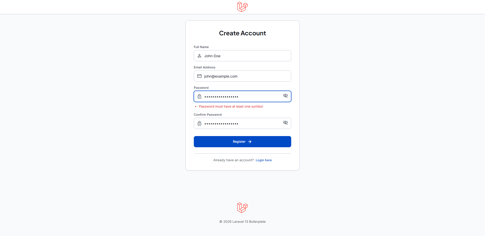
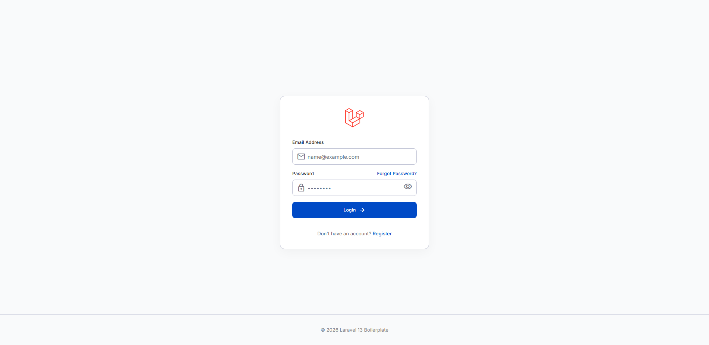
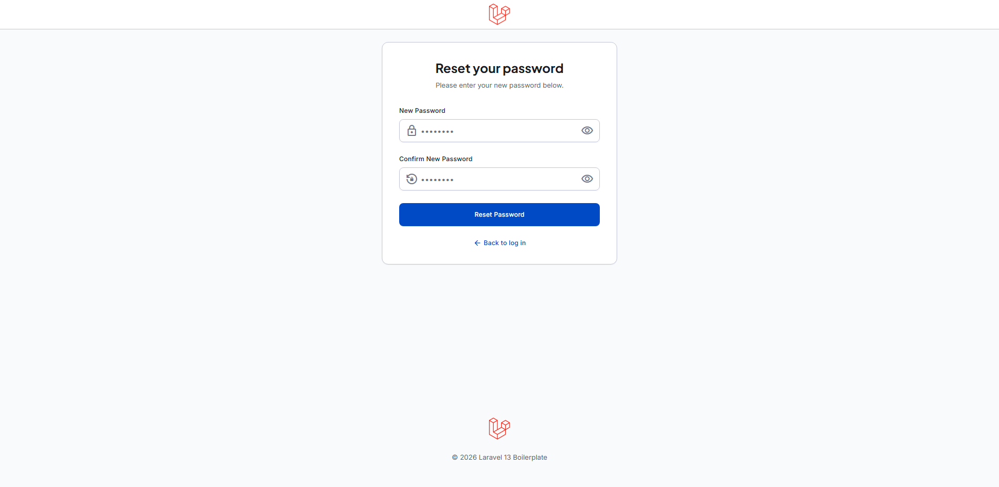
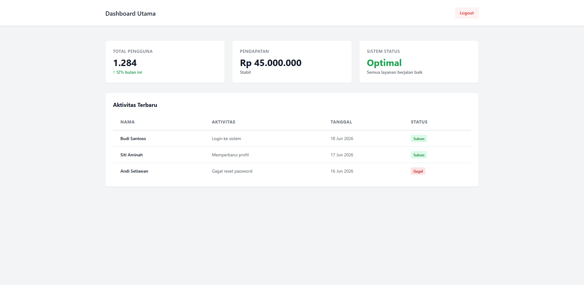

# Application Feature User Guide

This document explains how to use each feature of the application from an end-user
perspective. Each section is accompanied by screenshots to facilitate understanding
of the workflow.

## Table of Contents

1. [Landing Page](#1-landing-page)
2. [Creating a New Account](#2-creating-a-new-account)
3. [Logging In](#3-logging-in)
4. [Email Verification](#4-email-verification)
5. [Forgot Password](#5-forgot-password)
6. [Managing Profile](#6-managing-profile)
7. [Logging Out](#7-logging-out)

---

## 1. Landing Page

The landing page is the first entry point when you open the application.

### For Visitors (Not Registered)



**Available Features:**

- **Navbar with application name** — displays application identity
- **"Log in" button** — leads to login page
- **"Get Started" button** — leads to registration page

**Steps:**

1. Visit the application landing page
2. If you already have an account, click **Log in**
3. If you don't have an account yet, click **Get Started** to create a new one

---

### For Registered Users

If you are already logged in:

- The navbar displays **Dashboard** and **Logout** buttons
- Click **Go to Dashboard** to go to the main dashboard page
- Click **Logout** to exit your account

---

## 2. Creating a New Account

### Accessing the Registration Page


**How to open the registration page:**

1. Click **Get Started** or **Register** button from the landing page
2. Or visit directly: `/register`

### Filling Out the Registration Form

Fill the form with the following information:

| Field | Requirements | Example |
| --- | --- | --- |
| **Full Name** | Required | John Doe |
| **Email Address** | Valid email & not already registered | john@example.com |
| **Password** | Min. 8 chars, uppercase, lowercase, number, symbol | `Secret!Pass123#` |
| **Confirm Password** | Must match Password | `Secret!Pass123#` |

### Password Validation

As you type the password, the system will validate in real-time:

✅ **Minimum 8 characters long**

✅ **Contains uppercase (A-Z) and lowercase (a-z) letters**

✅ **Contains at least one number (0-9)**

✅ **Contains at least one symbol (!@#$%^&*)**

✅ **Password confirmation matches**

### When Errors Occur



Error messages may appear if:

| Error | Message | Solution |
| --- | --- | --- |
| Email empty | "The email field is required." | Enter a valid email |
| Invalid email | "The email field must be a valid email address." | Use format: `name@domain.com` |
| Email already taken | "The email has already been taken." | Use a different email or login with existing account |
| Password too short | "Password must be at least 8 characters long." | Use at least 8 characters |
| Weak password | "Password must contain both lowercase and uppercase letters" | Add uppercase & lowercase letters |
| No numbers | "Password must contain at least one number" | Add numbers (0-9) |
| No symbol | "Password must contain at least one symbol" | Add symbols (!@#$%^&*) |
| Confirmation mismatch | "Password must be the same as the confirmation" | Ensure password & confirmation match |

### Successful Registration

After filling all data correctly and clicking **Register**:

1. Your new account is created
2. The system automatically redirects to the email verification page
3. Message: "Verify your email address"

---

## 3. Logging In

### Accessing the Login Page



**How to open the login page:**

1. Click **Log in** button from the landing page
2. Or visit directly: `/login`

### Filling Out the Login Form

Enter your credentials:

1. **Email Address** — your registered email
2. **Password** — your account password
3. Click **Login** button

### When Credentials Are Wrong


If the email or password is incorrect, an error message will appear:

> **"These credentials do not match our records."**

**Solutions:**

- Double-check your email & password
- Make sure CAPS LOCK is not active
- Use an already registered account
- If you forgot your password, click **Forgot Password?**

### Login Successful — Account Verified

If your email is already verified:

1. The system redirects you to `/dashboard`
2. The dashboard page displays your account information

### Login Successful — Account Not Yet Verified

If your email is not yet verified:

1. The system redirects you to `/email/verify`
2. The email verification page is displayed
3. Follow the verification steps (see next section)

---

## 4. Email Verification

### When Is Verification Required?

Email verification is required in two situations:

1. **After registration** — new accounts are automatically directed to the verification page
2. **When logging in with an unverified account**

### Email Verification Page


**Message displayed:**

> "Verify your email address"

### Verification Steps

#### Option 1: Open Email Link

1. Open your email application (Gmail, Outlook, etc.)
2. Look for an email from the application with verification subject
3. Click the verification link in the email
4. Your email will be verified automatically
5. Return to the application, refresh the page
6. You will be redirected to the dashboard

#### Option 2: Resend Verification Email

If you didn't receive the email or deleted it:

1. On the verification page, click **Resend Verification Email** button
2. The system will send a new verification email
3. Success message will be displayed: *"A new verification link has been sent"*
4. Open the new email and click the verification link

### Log Out Without Verification

If you want to exit temporarily:

1. Click **Log out** button
2. You will return to the login page
3. Your email is still considered unverified
4. Every time you login, you will be asked to verify again

---

## 5. Forgot Password

### Accessing the Forgot Password Page


**How to open:**

1. From the login page, click **Forgot Password?**
2. Or visit directly: `/forgot-password`

### Request Reset Link

1. Enter your account **email**
2. Click **Send Instructions** button
3. The system will send an email containing the password reset link

### Verification Email Received

Within a few minutes, the email will arrive in your inbox:

1. Open your email application
2. Look for an email from the application with password reset subject
3. Click the password reset link

### Reset Password Page



**Reset password form contains:**

- **Email** — your email (usually pre-filled)
- **New Password** — new password you want to create
- **Confirm New Password** — confirm new password

### Creating a New Password

1. Fill **New Password** with your new password (same requirements as registration)
2. Fill **Confirm New Password** with the same password
3. Click **Reset Password** button

### New Password Validation

Your new password must meet the same requirements as during registration:

✅ Minimum 8 characters
✅ Uppercase & lowercase letters
✅ At least one number
✅ At least one symbol

### Successful Password Reset

After your password is reset:

1. The system redirects to the login page
2. Login with your email & new password
3. You can access your account again

### Reset Link Expired

Password reset links are only valid for a few hours:

- If the link has expired, repeat the process from the beginning
- Click **Forgot Password?** again to request a new link

---

## 6. Managing Profile

### Accessing the Dashboard



After logging in & verifying your email, you can access the dashboard by:

1. Click **Go to Dashboard** from the landing page, or
2. Click the dashboard menu from the navbar, or
3. Visit directly: `/dashboard`

### Dashboard Information

The dashboard displays:

- **Total Users** — number of registered users
- **Revenue** — current revenue data
- **System Status** — system health status
- **Recent Activity** — latest user activity log

### Dashboard Features

From the dashboard, you can:

- View a summary of your account
- View your login activity history
- Access profile settings
- Manage personal data

---

## 7. Logging Out

### Logout Button

**Logout button location:**

- Available in the navbar after you login
- Usually in the top right corner of the page

**How to logout:**

1. Click **Logout** button in the navbar
2. The system will end your session
3. You will return to the login page

### After Logout

- You are no longer authenticated
- Protected pages (`/dashboard`, etc.) cannot be accessed
- If you try to access `/dashboard`, you will be redirected to `/login`
- You must login again to access your account

---

## User Journey Summary Table

```
┌─────────────────────────────────────────────────────┐
│         USER JOURNEY FLOW                           │
└─────────────────────────────────────────────────────┘

1. Landing Page
   ↓
   ├─→ New? Click "Get Started" ──→ Registration (Section 2)
   │                                    ↓
   │                              Email Verification (Section 4)
   │                                    ↓
   │                              Dashboard (Section 6)
   │
   └─→ Already have account? Click "Log in" ──→ Login (Section 3)
                                                   ↓
                                              Email verified?
                                              ├─→ Yes → Dashboard (Section 6)
                                              └─→ No → Email Verification (Section 4)

Forgot password? ──→ Section 5
Want to logout? ──→ Section 7

```
